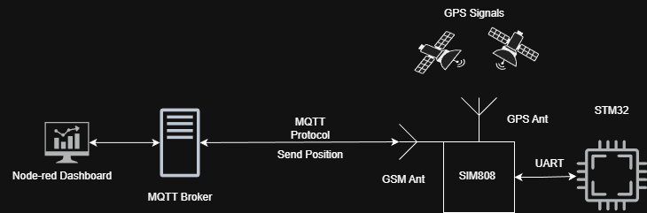
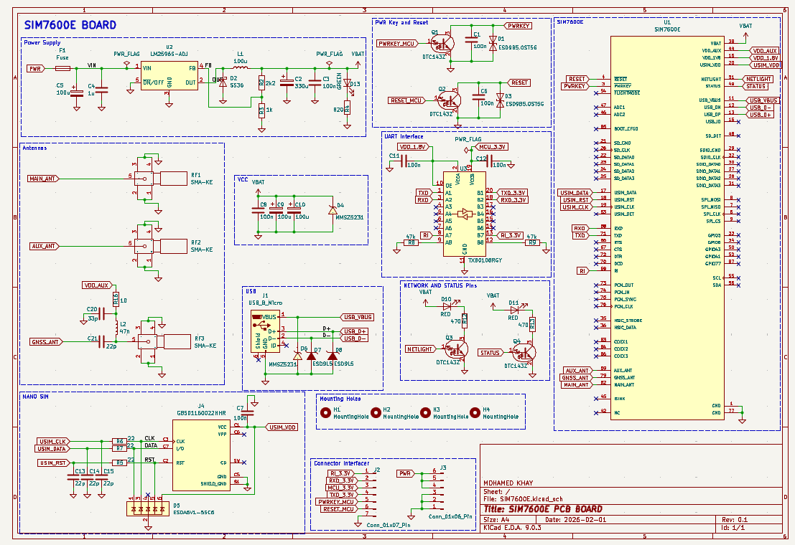
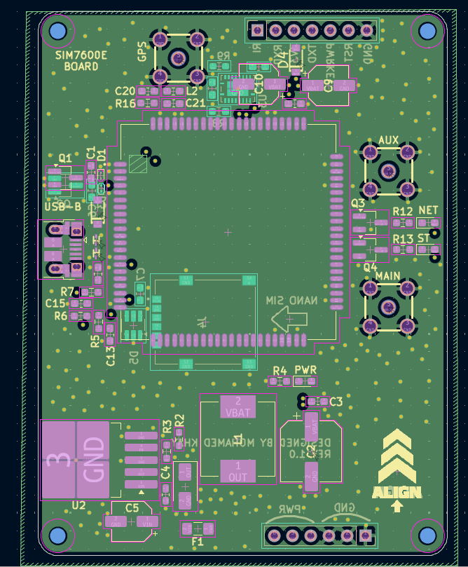
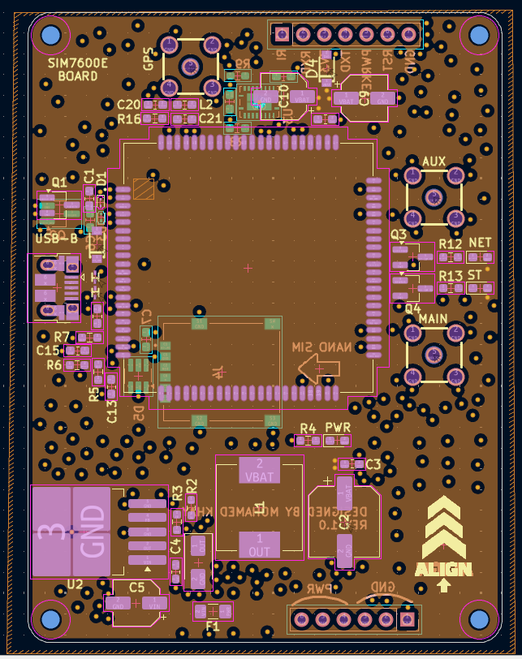
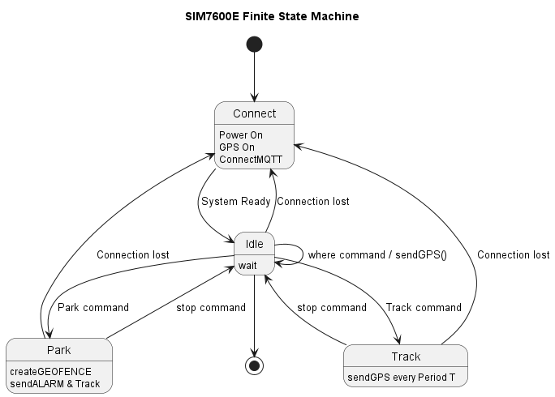

# STM32 SIM7600 GPS Tracker

This hobby project is designed to be a practical gadget that can be used in daily life, whether you own an expensive bike or car and want to detect theft once it is parked, or simply want to track anything using GPS and cloud connectivity. 
In this project, I will explain how I developed and built the system.

---

# Overview


The STM32 communicates with the SIM7600E module via UART. GPS data is parsed on the MCU and sent either via SMS or published to an MQTT broker. Node-RED processes incoming data and provides visualization and control.

---

# Features

- Custom PCB design
- GPS tracking
- MQTT publish/subscribe
- Geofence/Park mode
- Connection health monitoring
- Modular embedded software design

---

# Hardware
Since this project is intended to be a compact GPS tracker, I wanted to make it as small as possible while using the SIM7600E module. I decided to divide the hardware into two separate PCBs.

The first PCB contains the SIM7600E module and all the required supporting hardware, such as the SIM card holder, antennas, and its dedicated voltage regulator. The second PCB contains the STM32L072 microcontroller and the remaining supporting hardware components. Both PCBs are stacked together and communicate through a common connector interface.

Note: In this page, I will only discuss the SIM7600E board because the second board is still under development. I am currently adding extra features to it, such as a battery charging circuit and a gyroscope. Once it is completed, I will publish it as well. For now, I am using a Nucleo board for prototyping.

## Schematic


The first main step in designing a custom PCB is creating the schematic. The datasheet provided by SIMCom was very helpful, as it includes recommended circuits and components, which made the design process much simpler.

I used the same buck converter recommended in the datasheet, the LM2596S-ADJ, because the board is powered using a 2S LiPo battery, which can provide up to 8.4V when fully charged and around 7.4V typically.

A logic level shifter is used to convert the SIM7600E 1.8V logic levels to 3.3V logic levels, ensuring safe UART communication with the microcontroller.

For the antennas, I chose a much simpler design, except for the GPS antenna, which requires a so-called bias-tee circuit to properly power the active GPS antenna. This circuit was also recommended and explained in the SIMCom datasheet.

Some LEDs were also added to visualize the network status.

In general, the SIM7600E supports many additional features, such as an SD card interface, but I only implemented the features that were necessary for this project.

## Footprints and Layout
<p align="center">
  
  
  
  
</p>

After reviewing the schematic, the next step is selecting the appropriate footprints. I have included the footprints I used, along with the symbols and 3D models, in the folder PCB Design/SIM7600E.

If this is your first time designing a PCB, like it was for me, avoid making the same mistake I did by choosing footprints that are too small for resistors, capacitors, and LEDs, especially if you plan to solder the board yourself.

For the PCB layout, I chose a 4-layer design to improve performance. The two inner layers are dedicated to the ground plane and power plane. 

This step is very important because a good PCB layout greatly affects the overall performance of the board, especially for the buck converter and high-frequency signals. 

## Manufacturing 

<p align="center">
  
  
</p>

I ordered the PCB from JLCPCB and the components from LCSC, then soldered the board myself.

The BOM and component position files can be found here: `PCB Design/SIM7600E/production`

---

# Software Architecture

## Main Modules

```text
Core/
├── Inc/
  ├── min.h
  ├── SIM7600E.h
  ├── system_fsm.h
  ├── timer.h
  └── log.h
├── Src/
  ├── min.c
  ├── SIM7600E.c
  ├── system_fsm.c
  └── timer.c
```

`SIM7600.h` and `SIM7600.c` contain all the required functions to communicate with the SIM7600E module using UART, including GPS positioning, power control, SMS handling, and MQTT publish/subscribe functionality.

`system_fsm.h` and `system_fsm.c` contain the implementation of the finite state machine, which will be explained in the next section.

`timer.h` and `timer.c` contain the functions related to the timers used for tracking and system monitoring.

`log.h` contains an overridden version of the `printf` function used for logging general information, errors, and communication between the STM32 and the SIM7600E module for debugging purposes.


---

# State Machine



The firmware uses an event-driven finite state machine.

## States

- CONNECT
- IDLE
- TRACK
- PARK

## Description

The CONNECT state is responsible for checking the status of the system components. It verifies whether the SIM module is powered, whether the network and MQTT connection are established, and whether the GPS is enabled. If any component is not ready, the state attempts to initialize or reconnect it accordingly. Once everything is ready, the system transitions to the IDLE state, where it waits for incoming events or commands.

If a `WHERE` command is received, the device immediately sends its current GPS position.

If a `TRACK` command is received, the system transitions to the TRACK state. In this state, a timer is started, and the device periodically sends its GPS position until a `STOP` command is received, after which the system returns to the IDLE state.

If a `PARK` command is received, the system transitions to the PARK state. First, the current GPS position is sent in order to create a geofence around the parked location (explained later in the Node-RED section). A timer is then started to continuously monitor the device position. If a geofence breach occurs, meaning the tracked device moves away from the allowed area, an alert is sent and the system automatically switches to TRACK mode since this may indicate a potential theft attempt.

In all states, another timer called `sysHealth_Timer` runs every 5 seconds to monitor the health of the communication stack. If a connection loss is detected in any state, the system automatically transitions back to the CONNECT state to recover the connection and then returns to the previous operational state.

## Why State Machine ?

Since this project is intended to work as an anti-theft tracker, it contains several different states and operating modes. Using a state machine makes the system more organized, prevents illogical scenarios, and makes the firmware easier to extend in the future.

For example, new subtasks, events, or operating modes can be added more easily. I also plan to allow the user to select these modes through hardware buttons, so having a state-machine-based architecture will make this feature easier to implement later.

---
# Node-Red

Node-RED is widely used in IoT and network-related applications, and it supports the MQTT protocol natively. In addition, it is very easy to use and implement thanks to its drag-and-drop interface and simple JavaScript programming.

Node-RED subscribes to the same MQTT topic used by the SIM7600E module, receives the GPS position data, and then sends it as JSON data to a world map dashboard for visualization.

I also added support for different operating modes because each mode requires a specific type of visualization. For example, in TRACK mode, the system displays the traveled path, while in PARK mode, it creates a circular geofence around the parked position. The different visualizations are shown in the following pictures.

---

# Future Improvements

- Add a gyroscope/accelerometer for PARK mode in order to detect even the smallest movements. GPS data always has some tolerance and can sometimes vary by up to several meters, making it unreliable for immediate theft detection. By using a gyroscope or motion sensor, the system could instantly detect movement and then rely on GPS for long-distance tracking.
- Add a database to the Node-RED dashboard to give the project memory capabilities, allowing users to save and review previous trips, routes, and tracking history.
- Add battery monitoring functionality to the second PCB in order to monitor battery level and improve power management.


---

# Author

Mohamed Khay
Computer Engineering Student
